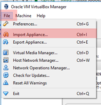
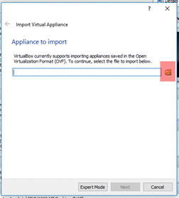
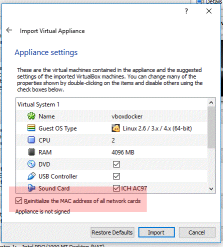
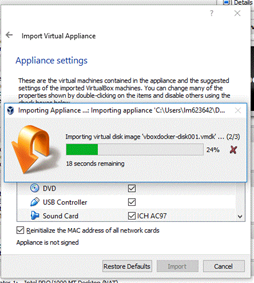
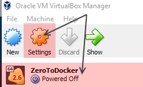
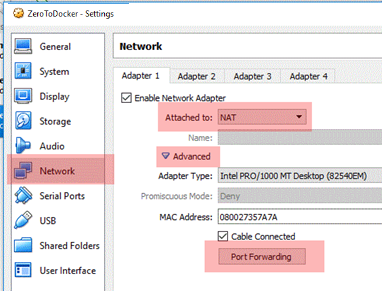
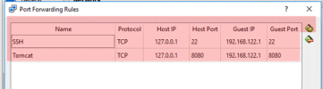

# From Zero to Docker in under 30 min
An ioexcept production

#### Step 1, we need a virtualization engine
*there are others hypervisors, but for this 30 min jump into the future, we're going to go with VirtualBox*

[Download VirtualBox](https://download.virtualbox.org/virtualbox/5.2.18/VirtualBox-5.2.18-124319-Win.exe)

#### Step 2, now we need an OS
 * Option A
    - Download the pre-built appliance (this tutorial targets Option A)
 * 	Option B
    - Download your favorite flavor of linux - Option B isn't supported as part of this tutorial

##### Option A
 download the CentOS 7 Appliance [Here](https://drive.google.com/open?id=1rq4qv4xXvZVriBoV6Pp9A50UcfQ1_QKh)

 1. Start VirtualBox
 2.  Select: File / Import Appliance   
 

 3. Locate the File, zerotodocker and select [Next]  

 4. &#x1F53B; *Important Step:  On the Appliance Settings, ensure you check “[x] Reinitialize the MAAC Address of the network cards”*  
NOTE: this ensure all traffic is routed to your VM’s mac address and there is not a conflict. With NAT there should be no conflict, however, no one wants to be “that guy”  

5. finally import  

### Appliance Configuration
1. Once the appliance has been imported, select the Image and then Settings  

2. Select ‘Network, Attach To [NAT], Click the arrow for Advanced and then click [Port Forwarding]  

3. You should see the original settings already implemented for SSH and Tomcat, you wont (should not) need to add these.  

&#x1F53B; For your application(s)
In the top right under the [X] button, select the icon [New] and add ports you have mapped to your internal service(s), for example:
* Port 8080 for JBoss
* Port 1521 for Oracle SQL  
* Port 27017 for Mongo
* Port 6379 for Redis
* Port 3306 for MySQL
* Port 3306 for MySQL
* Port 8091 for Couchbase Console
* Port 11213 for Couchbase DB  

&#x1F53B; *These are the default ports that the applications reside on natively.  You will need to forward the port you want on the Host (the machine running VirtualBox), the value under [Host IP], value under [Guest IP] to the port you have mapped within docker with the –p command.*  

### Start and login to the VM

1. Start a terminal session
